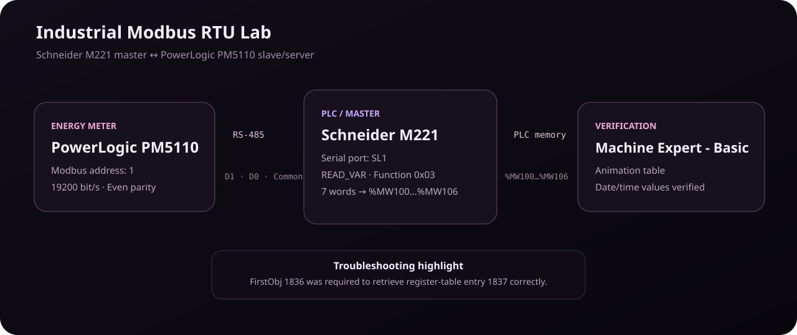

# Industrial Modbus RTU Integration — Schneider M221 ↔ PowerLogic PM5110

**Type:** Team university laboratory  
**Course:** Industrial Networks  
**Date:** 2026-08-13  
**Status:** Verified laboratory result

> This case study is based on a team laboratory report. It documents the verified technical work without claiming that every task was completed individually by Gabriel. Individual contribution can be refined later.

## Objective

Establish serial communication between a Schneider Electric PowerLogic PM5110 energy meter and a Schneider M221 PLC using **Modbus RTU over RS-485**, then read the PM5110 internal clock registers from the PLC and verify the values in EcoStruxure Machine Expert - Basic.

## Architecture

- **PLC:** Schneider M221
- **Energy meter:** Schneider Electric PowerLogic PM5110
- **Physical layer:** RS-485
- **Protocol:** Modbus RTU
- **PLC serial port:** SL1
- **PLC role:** Modbus master/client
- **PM5110 role:** Modbus slave/server
- **PM5110 address:** 1
- **Baud rate:** 19200 bit/s
- **Parity:** Even

## RS-485 wiring used

| M221 RJ45 SL1 | Signal | PM5110 |
|---|---|---|
| Pin 4 | D1 / Data+ | D1 (+) |
| Pin 5 | D0 / Data− | D0 (−) |
| Pin 8 | Common | C |

For the T568B cable used in the lab, pins 4, 5 and 8 corresponded to blue, white/blue and brown conductors respectively.

## Register map used

The PM5110 clock data occupied seven consecutive register-table entries:

| Register-table entry | Data | PLC destination |
|---:|---|---|
| 1837 | Year | %MW100 |
| 1838 | Month | %MW101 |
| 1839 | Day | %MW102 |
| 1840 | Hour | %MW103 |
| 1841 | Minute | %MW104 |
| 1842 | Second | %MW105 |
| 1843 | Millisecond | %MW106 |

## READ_VAR configuration

| Field | Value | Purpose |
|---|---|---|
| Link | 1 - SL1 | Select serial line 1 |
| Id | 1 | PM5110 Modbus address |
| Timeout | 100 | Maximum response wait |
| ObjType | Read multiple words - Modbus 0x03 | Read holding registers |
| FirstObj | 1836 | Offset used to retrieve table entry 1837 |
| Quantity | 7 | Read seven consecutive words |
| IndexData | 100 | Store first result at %MW100 |

## Troubleshooting highlight

A useful part of the lab was the register-addressing correction. The correct data appeared after changing **FirstObj to 1836**, even though the first desired register-table entry was **1837**. This is a practical example of why device register tables and software addressing conventions must be checked carefully instead of assuming that displayed register numbers map one-to-one to request offsets.

## Verification

The PLC animation table displayed:

- `%MW100 = 2026`
- `%MW101 = 8`
- `%MW102 = 12`
- `%MW103 = 19`
- `%MW104 = 11`
- `%MW105 = 52`
- `%MW106 = 0`

This corresponded to **12/08/2026 19:11:52**.

## Periodic update behavior

`READ_VAR` requires a new activation edge on `EXECUTE` to perform another read. Leaving `EXECUTE` continuously high does not continually refresh the values. A one-second pulse or equivalent timer-based trigger can be used, while respecting the block's `BUSY` state to avoid starting a new request before the previous one finishes.

## Skills demonstrated

- Industrial serial networking
- RS-485 wiring and signal mapping
- Modbus RTU master/slave configuration
- Manufacturer register-table interpretation
- PLC memory mapping
- Schneider EcoStruxure Machine Expert - Basic
- `READ_VAR` / Modbus function 0x03
- Troubleshooting address offsets
- Validation with PLC animation tables

## Why this matters for OT security

This laboratory becomes useful security groundwork because it creates direct familiarity with an industrial protocol, device roles, register maps, serial communication parameters and controller memory. A future security extension can document expected traffic, identify critical registers, build a read-only Python monitor, and analyze what should be protected or monitored in this communication path.

## Next portfolio upgrades

- Add sanitized screenshots from the original laboratory evidence.
- Record Gabriel's exact individual contribution to the team lab.
- Build a read-only Python / PyModbus companion tool against an authorized lab setup.
- Add a threat model and defensive notes using NIST SP 800-82 / MITRE ATT&CK for ICS concepts later in the roadmap.
