# IoT Irrigation System with Embedded Moisture Control and AC Power Stage

**Type:** University prototype · evidence-backed system description  
**Course context:** Power Electronics / IoT control project  
**Project period:** 2026  
**Portfolio status:** Functional prototype evidence + Proteus project files available

> The current evidence set includes a physical breadboard prototype photo, a Proteus project archive, a routed-layout export and Gabriel's technical description of system behavior. The individual/team task split has not yet been documented, so this portfolio does not claim exclusive authorship.

## Problem

The project explored a compact irrigation controller capable of reacting to soil moisture while also exposing process variables remotely. A capacitive moisture sensor provided the environmental input; an embedded controller evaluated that measurement and commanded the pump so irrigation could be reduced or increased instead of operating as a simple fixed on/off system.

## Architecture

### Control flow

1. **Capacitive soil-moisture sensor** measures the process variable.
2. **ESP32-S3** receives the sensor signal and evaluates irrigation demand.
3. The controller generates a variable pump command based on the moisture condition / remote setpoint.
4. The Proteus design contains an isolated power-control stage built around a **MOC3021 optotriac driver** and **BTA12-600B TRIAC** for the AC load path.
5. The pump drives water toward the sprinkler / irrigation output.
6. A phone or tablet provides the IoT-facing interface for observing and adjusting variables in real time.

## Proteus evidence

The supplied Proteus archive includes an **ESP32-S3-DEVKITC-1** simulation model and power-electronics components including a **MOC3021**, **BTA12-600B**, **PC817**, discrete resistors/capacitors and terminal blocks for sensor/load connections. The separate one-page export appears to be a routed PCB/layout view rather than a labeled schematic, so the portfolio treats it as layout evidence and does not infer net-level behavior from that image alone.

## Physical prototype evidence

One supplied breadboard photo visibly contains an **Arduino Uno** development board. Because Gabriel describes the project controller as an ESP32 and the Proteus project includes an ESP32-S3 model, the photo is labeled as an **early / bench prototype** rather than used as proof of the final controller architecture. This discrepancy should be refined if additional build photos or firmware are provided.

## What this project demonstrates

- embedded sensor acquisition;
- soil-moisture-based control logic;
- IoT telemetry / remote adjustment concept;
- power electronics for controlling an AC load;
- optically isolated gate-drive concepts;
- integration of low-voltage control electronics with a higher-power pump stage;
- Proteus schematic / PCB workflow;
- physical breadboard prototyping and troubleshooting.

## Professional value

This project is useful evidence for **cyber-physical systems** because it joins sensing, embedded decision-making, remote connectivity and physical actuation. It also provides a natural future bridge into **IoT / OT security**: authentication, telemetry integrity, safe fallback behavior, command authorization and network-loss handling can all be threat-modeled later without changing the original academic result.

## Evidence still worth adding

- ESP32 firmware or final source code;
- screenshot of the phone/tablet IoT dashboard;
- final ESP32 hardware build photo if available;
- exact capacitive-sensor model;
- pump voltage / power rating;
- explanation of how the variable command was generated (for example, phase-angle control, duty-cycle control or another strategy);
- confirmation of whether the Arduino Uno photo is an early prototype stage or a separate test setup.
