# Low-Cost Automated Cell for Rapid PCB and Enclosure Prototyping

**Type:** Team university project · full-process participation  
**Context:** Automated manufacturing / digital fabrication  
**Project period:** 2026  
**Status:** Verified from project paper, plan set and Autodesk Fusion 360 archive

> This project was completed collaboratively. Gabriel reports full-process participation rather than a narrow task split, including design review, fabrication-flow execution, PCB prototyping support, evidence gathering and documentation.

## Problem

Rapid PCB iteration becomes inefficient when every prototype must be ordered externally. For a university IoT project, that delay makes it harder to test, debug and redesign electronics quickly. The project therefore developed a low-cost hybrid manufacturing cell intended to produce basic PCB prototypes locally while also supporting enclosure and structural-part fabrication.

## System overview

The cell integrates five manufacturing stages:

1. **Digital design** in Proteus 8 Professional and Autodesk Fusion 360.
2. **Automated PCB tracing** with an Arduino Uno-based CNC plotter.
3. **Supervised chemical etching** to remove exposed copper.
4. **Support-part fabrication** through PETG 3D printing, laser cutting / engraving and CNC/ShopBot machining.
5. **Verification** using visual inspection and basic continuity checks.

## Architecture



### Core machine configuration

- **Controller:** Arduino Uno
- **Motion:** NEMA 17 stepper motors on X/Y
- **Z-axis actuation:** SG90 servomotor
- **Mechanics:** GT2 belts/pulleys, LM8LUU bearings, 8 mm rods and MGN12H linear rail
- **PCB design:** Proteus 8 Professional
- **Mechanical / enclosure design:** Autodesk Fusion 360
- **Toolpath:** G-code
- **PCB substrate:** copper-clad board
- **Masking method:** permanent Sharpie marker

## PCB fabrication workflow

```text
Proteus PCB design
        ↓
G-code / toolpath preparation
        ↓
Arduino CNC plotter
        ↓
Sharpie trace on copper-clad board
        ↓
Supervised chemical etching
        ↓
Cleaning + visual inspection + continuity check
```

The chemical etching step used a supervised hydrochloric-acid / hydrogen-peroxide process in the university laboratory. The portfolio records this as part of the documented manufacturing workflow rather than as a recommendation for unsupervised use.

## Complementary digital-manufacturing processes

The cell was intentionally broader than the PCB plotter itself. Project evidence also documents:

- PETG 3D printing for structural parts and electronics housing;
- laser cutting of acrylic and MDF parts;
- laser engraving for the reference bed and project logo;
- CNC/ShopBot machining for the main base;
- enclosure and cable-management elements for IoT-oriented hardware prototypes.

## Quantitative results supported by the project paper

- **Estimated basic-PCB fabrication time:** 15–20 minutes
- **Total prototype budget:** HNL 4,869.27
- **3D-print material:** 340 g PETG
- **3D-print duration:** approximately 7 h 20 min
- **Laser-cut enclosure support:** acrylic 3 mm, approximately 120 × 150 mm
- **ShopBot base:** 420 × 360 mm, approximately 20 min machining time
- **Pilot OEE estimate:** 61.2%
- **Estimated break-even:** approximately 18 PCBs under the project’s stated cost / price assumptions

## Verified result

The team constructed a functional CNC plotter, validated X/Y motion and Z-axis actuation, and produced a basic PCB on copper-clad board. After etching, the resulting board showed visible and defined traces. The project therefore demonstrated that the digital design could be transferred to a physical PCB through the proposed local fabrication workflow.

## Limitations

The paper explicitly notes that trace uniformity and surface cleanliness can still improve. Likely contributing variables include marker pressure, board fixation and etching exposure time. The project therefore treats the result as a **successful university-scale prototype**, not as a production-grade substitute for industrial multilayer PCB fabrication.

The lead-time comparison against an external 4–8 week benchmark is also framed as a project-level comparison for basic prototypes rather than a universal manufacturing claim.

## Skills demonstrated

- Digital manufacturing
- CNC motion systems
- Arduino-based machine control
- G-code workflow
- PCB prototyping
- Proteus 8 Professional
- Autodesk Fusion 360
- 3D printing
- Laser cutting / engraving
- CNC / ShopBot machining
- Manufacturing process integration
- Cost analysis
- OEE reasoning
- Prototype validation
- IoT hardware prototyping

## Professional value

This case study demonstrates systems-level mechatronics work across **CAD/CAM, machine motion, electronics prototyping, materials processing, manufacturing economics and validation**. It is especially relevant to Gabriel’s target profile in automation, digital manufacturing and cyber-physical systems because it shows an ability to integrate several engineering domains into one working manufacturing process.

## Evidence policy

The source plan set contains another teammate’s name in the drawing title block. Public portfolio visuals therefore use sanitized / cropped technical evidence rather than publishing those title blocks directly. The original file remains team evidence and is not altered to falsely claim individual authorship.

## Future engineering upgrades

- quantify repeatability across several PCB designs;
- record actual dimensional trace error;
- measure continuity yield across multiple boards;
- improve marker-pressure consistency;
- improve board fixturing;
- document GRBL / firmware settings if available;
- add a more formal lead-time, scrap and OEE data collection procedure.
