# Raspberry Pi Eye-Tracking Writing System

**Type:** University project with independently implemented Raspberry Pi software  
**Course:** Sensors and Actuators  
**Project period:** 2025  
**Portfolio status:** Functional prototype documented from source code + course artifacts

> The course project was presented as a team assignment, but Gabriel reports that he personally implemented the Raspberry Pi eye-tracking software documented here. The public portfolio keeps that distinction explicit: the academic project context was collaborative; the Raspberry Pi software implementation was his individual work.

## Problem

The project explored a low-cost hands-free writing interface for users with severe motor limitations. The concept was to detect pupil position, convert the gaze into normalized coordinates, map those coordinates to a virtual keyboard on a laptop, and return selected letters to a small OLED mounted on the prototype glasses.

The course material framed the system as an accessibility-oriented alternative to expensive commercial eye-tracking solutions. The prototype emphasized low-cost embedded hardware, computer vision and a wearable form factor.

## Final implementation represented in this portfolio

The implementation documented from the submitted Python source contains these major pieces:

- camera capture through OpenCV;
- grayscale preprocessing, CLAHE contrast enhancement and Gaussian blur;
- percentile-based dark-region thresholding for pupil segmentation;
- morphological opening/closing to reduce binary noise;
- contour filtering by area, aspect ratio, circularity and solidity;
- candidate scoring based on contour area and mean intensity;
- normalized gaze coordinates;
- jump suppression plus optional Kalman filtering or weighted moving-average smoothing;
- UDP transmission of gaze coordinates from the Raspberry Pi to a laptop;
- a second UDP channel for calibration and letter/word feedback from the laptop;
- optional SSD1306 128×64 OLED output over I2C;
- live FPS, threshold and detection visualization for debugging.

## Architecture



### Data flow

1. **GC0308 camera → Raspberry Pi 4B**: capture an eye image frame.
2. **OpenCV processing**: enhance the frame and segment dark pupil candidates.
3. **Contour validation**: reject candidates that do not satisfy geometry/area rules.
4. **Coordinate smoothing**: normalize and smooth the selected pupil center.
5. **UDP → laptop**: send `X:<value>,Y:<value>` gaze coordinates.
6. **Laptop application**: calibration / virtual-keyboard logic maps gaze to letters.
7. **UDP feedback → Raspberry Pi 4B**: messages such as `LETRA:`, `CALIBRANDO:`, `BORRAR`, `LIMPIAR` and `ESPACIO` update the local state.
8. **OLED feedback**: show current letter, word buffer, tracking coordinates or calibration status.

## Hardware represented by the course artifacts

- **Raspberry Pi 4 Model B**
- GC0308 camera module
- 0.96-inch 128×64 OLED
- jumper wiring
- TP4056-based charging/power components used during the wearable prototype work
- glasses / wearable mounting prototype

### Raspberry Pi model note

The project used a **Raspberry Pi 4 Model B**. The earlier mention of Raspberry Pi 5 in the portfolio was incorrect and has been removed; Pi 5 belongs to a different future project idea and is not part of this eye-tracker implementation.

## Detection pipeline

```text
Camera frame
   ↓
Grayscale
   ↓
CLAHE contrast enhancement
   ↓
Gaussian blur
   ↓
Dark-pixel percentile threshold
   ↓
Morphological close/open
   ↓
Find contours
   ↓
Area / aspect ratio / circularity / solidity filters
   ↓
Score valid candidates
   ↓
Pupil center
   ↓
Normalize + smooth
   ↓
UDP gaze coordinates
```

The algorithm is deliberately lightweight enough to run at the edge without a large neural-network model. That makes the project useful evidence of classical computer vision, embedded integration and real-time systems thinking.

## What the original code already did well

- separated pupil candidate validation from detection;
- used several geometric checks instead of trusting the darkest contour blindly;
- included temporal smoothing and an optional Kalman filter;
- rate-limited UDP coordinate transmission;
- implemented two-way communication rather than a one-direction demo;
- integrated OLED feedback with the tracking state;
- included a debug binary-image view and runtime FPS feedback.

## Code review: improvements made for the portfolio version

The original submitted source was reviewed as evidence but is **not published verbatim** in this public portfolio because it contains machine-specific local configuration. Instead, a separate **refactored portfolio version** preserves the core behavior while making the public code cleaner and safer to reuse.

The refactor adds:

- command-line configuration instead of publishing a hard-coded laptop IP;
- structured configuration with a dataclass;
- explicit camera-open validation;
- graceful cleanup of camera, sockets, windows and OLED;
- a stop event for the UDP listener thread;
- a lock around shared letter/word/calibration state;
- rate-limited OLED refresh so I2C updates do not unnecessarily compete with frame processing;
- safe handling of an empty thresholding input;
- logging instead of silently swallowing most runtime errors;
- configurable coordinate inversion;
- clearer separation between networking, display, smoothing and detection responsibilities;
- basic validation for UDP payload size and UTF-8 decoding.

The refactor intentionally **does not claim improved accuracy** because no controlled before/after dataset was provided. It is a software-engineering improvement, not a fabricated performance result.

## Verified / supported result

The project artifacts show a functional wearable prototype and report that the eye-tracking system could interact with the virtual keyboard. They also identify **lighting conditions and individual calibration** as important limitations. No raw test dataset was provided with the files, so the portfolio does not claim a measured accuracy percentage, words-per-minute rate or latency result.

## Skills demonstrated

- Python
- OpenCV
- NumPy
- Raspberry Pi 4B / embedded Linux
- Computer vision
- Image preprocessing
- Contour analysis
- Real-time coordinate filtering
- Kalman filtering concepts
- UDP sockets
- Threading
- I2C / SSD1306 OLED integration
- Human-computer interaction prototype
- Assistive technology
- Embedded debugging
- Hardware/software integration

## Professional value

This project is strong portfolio evidence because it combines several layers that are normally separated in student work: physical hardware, computer vision, networking, concurrent software, user feedback and an actual human-machine interface. It supports future paths in **embedded systems, robotics, computer vision, product security and cyber-physical systems**.

## Files

- [`src/eye_tracker_refactored.py`](../../projects/eye-tracker/src/eye_tracker_refactored.py) — cleaned portfolio version
- [`requirements.txt`](../../projects/eye-tracker/requirements.txt) — Python dependencies / notes
- architecture diagram — `portfolio/assets/eye-tracker-topology.svg`

## Future engineering upgrades

These are roadmap ideas, not claims about the original prototype:

- isolate a calibrated eye region-of-interest instead of processing the entire frame;
- store calibration profiles per user;
- collect a labeled test set for repeatable accuracy measurements;
- measure end-to-end latency instead of relying on visual responsiveness;
- add packet sequence numbers/timestamps for better UDP diagnostics;
- define a small structured message format instead of ad-hoc text commands;
- add unit tests for contour validation, message parsing and coordinate smoothing;
- package configuration into a `.toml`/`.yaml` file;
- threat-model the laptop ↔ Raspberry Pi control channel as a future product-security exercise.
